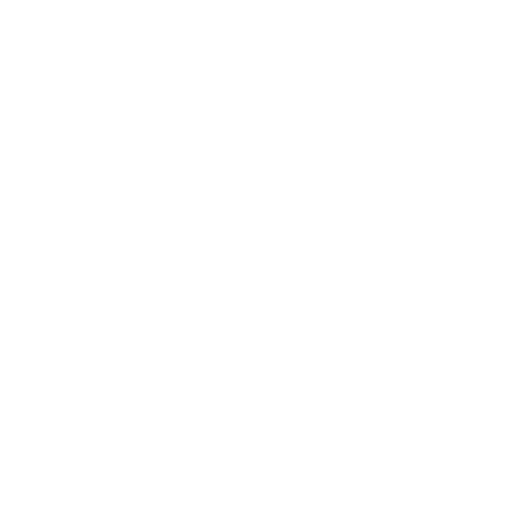

<div align="center">
  

  <h1>Dota 2 Mod Manager</h1>

  <p><b>Desktop mod launcher for Dota 2.</b> Browse 1100+ cosmetic mods and install them in one click. The app copies files, allocates pak slots and cleans up after itself.</p>

  <p>
    <a href="https://github.com/TheFleece/dota2-mod-manager/releases/latest">
      
    </a>
    
    
  </p>

  
</div>

---

## Features

| | | |
|---|---|---|
|  | **Full catalog** | 1100+ mods in 40 categories: heroes, terrains, shaders, fonts, cursors, announcers, music. Synced with the [Dota2PornFx](https://github.com/h6rd/Dota2PornFxWeb) repository |
|  | **One-click install** | The app downloads the mod, picks a free pak slot, gives priority mods `!pak` names and unpacks terrain `maps/` folders |
|  | **Built-in previews** | Video and audio previews play in an in-app player |
|  | **Library** | Toggle installed mods on and off without deleting them, remove them cleanly, see files installed outside the manager |
|  | **Filters and search** | Sort by date or name; filter by tag, hero or installed state; search across the whole catalog |
|  | **Packs** | Open a themed pack, drop the mods you don't want, save the result as your own pack |
|  | **Presets** | Save named sets of enabled mods and switch between them in one click |
|  | **Fonts and cursors** | Installed into game files with a backup of the originals; removal restores vanilla |
|  | **Tools** | Download and launch community utilities (Background Changer, ItemsFix, Compiler) from the app |
|  | **Auto-updates** | The app checks GitHub Releases and installs new versions itself |

<div align="center">
  
  
</div>

## Installation

1. Download **Dota 2 Mod Manager Setup** from the [latest release](https://github.com/TheFleece/dota2-mod-manager/releases/latest)
2. Run it. The app installs, creates a desktop shortcut and starts
3. It finds your Dota 2 installation on its own (you can change the path in Settings)
4. Add the launch option shown in **Settings** to Steam (`Steam → Dota 2 → Properties → Launch Options`):

```
-language russian
```

Mods load from a custom language folder (`game/dota_russian`, `dota_123`), so the game needs a matching `-language` launch option. If you play in Russian, use `dota_russian` / `-language russian`: the game stays Russian and mods work. Fonts and cursors need no launch option at all.

## How it works

The app follows the same installation mechanics as the Dota2PornFx guides:

- VPK mods go into `steamapps/common/dota 2 beta/game/dota_<suffix>/` as `pakNN_dir.vpk`; the app assigns slots 10–99
- Priority categories (trees, river, shaders, hero fx, ranged attack, hero items, optimization) get `!pakNN` names and load first
- Terrains ship a `maps/` folder, placed next to the paks
- Fonts go to `game/dota/panorama/fonts`, cursors to `game/dota/resource/cursor`; the app backs up originals and restores them on removal
- Disabling a mod renames its file to `.off`; the game skips it, the file stays

Downloads live in `%APPDATA%/dota2-mod-manager/downloads`, the install manifest in `manifest.json` next to it.

<div align="center">
  
</div>

## Установка (Russian)

1. Скачай **Dota 2 Mod Manager Setup** из [последнего релиза](https://github.com/TheFleece/dota2-mod-manager/releases/latest)
2. Запусти. Приложение установится, создаст ярлык и откроется
3. Путь к Dota 2 находится автоматически
4. Добавь параметр запуска из **Настроек** в Steam (`Steam → Dota 2 → Свойства → Параметры запуска`):

```
-language russian
```

Играешь на русском — используй `dota_russian` / `-language russian`: игра останется русской, моды будут работать. Шрифты и курсоры работают без параметра запуска.

## Development

```bash
git clone https://github.com/TheFleece/dota2-mod-manager.git
cd dota2-mod-manager
npm install
npm start        # run from source
npm run dist     # build the Windows installer
```

Stack: Electron, plain HTML/CSS/JS renderer, no build step for the UI.

## Remote catalog configuration

The launcher now reads the catalog from a remote JSON file instead of a local site copy. The default public source is:

```bash
DOTA2SKINS_CATALOG_URL=https://raw.githubusercontent.com/artem-prime42/dota2-mod-manager-catalog/main/catalog.json
```

You can override it with your own repository URL if needed.

Releases build automatically: push a `v*` tag and GitHub Actions compiles the installer and publishes it. Installed apps pick the update up on their own.

## Credits

- **All mods, previews, guides and catalog data** come from the open-source
  [**Dota2PornFxWeb**](https://github.com/h6rd/Dota2PornFxWeb) repository by [h6rd](https://github.com/h6rd)
  and the Dota 2 modding community. This app is a desktop client for their catalog.
  Each mod card in the app credits its author.
- Community tools (VPKMerge, Background Changer, Compiler, ItemsFix) belong to their authors.

## License

[GPL-3.0](LICENSE), free to use, modify and share. Catalog content carries the same license in the
[upstream repository](https://github.com/h6rd/Dota2PornFxWeb).

*Not affiliated with Valve Corporation. You modify game files at your own risk.*
